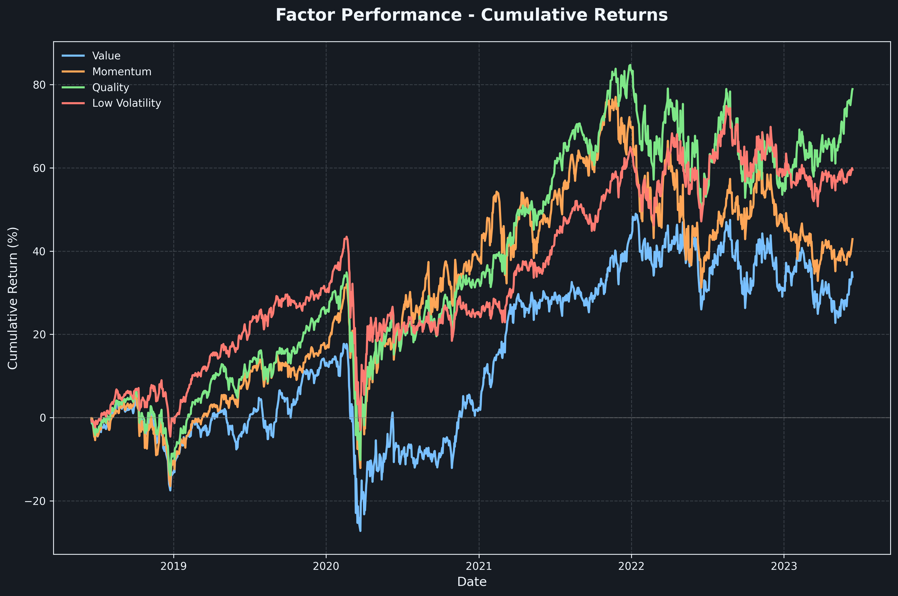
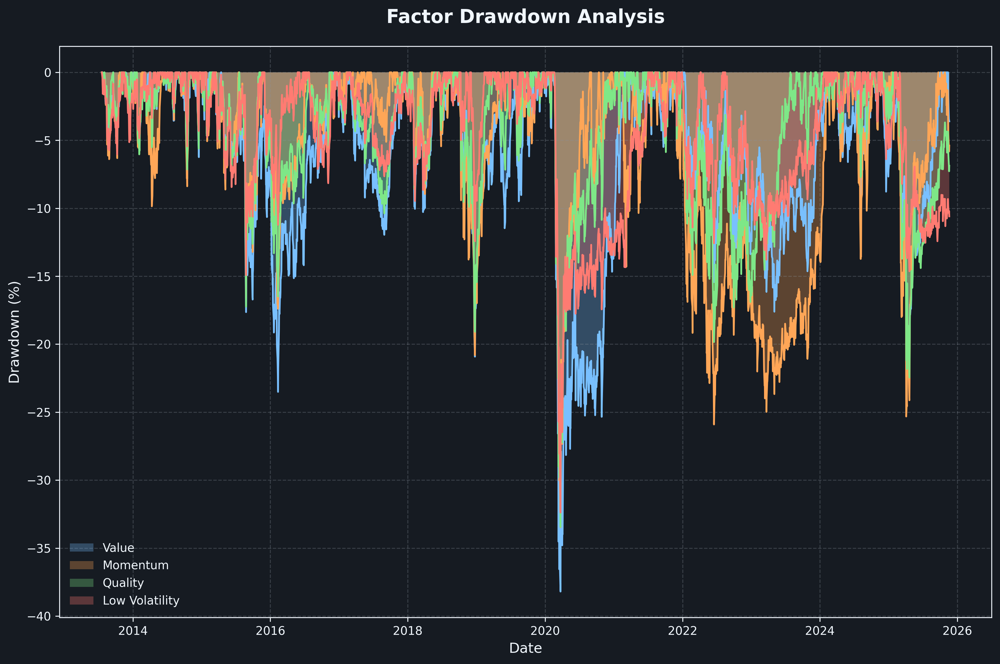
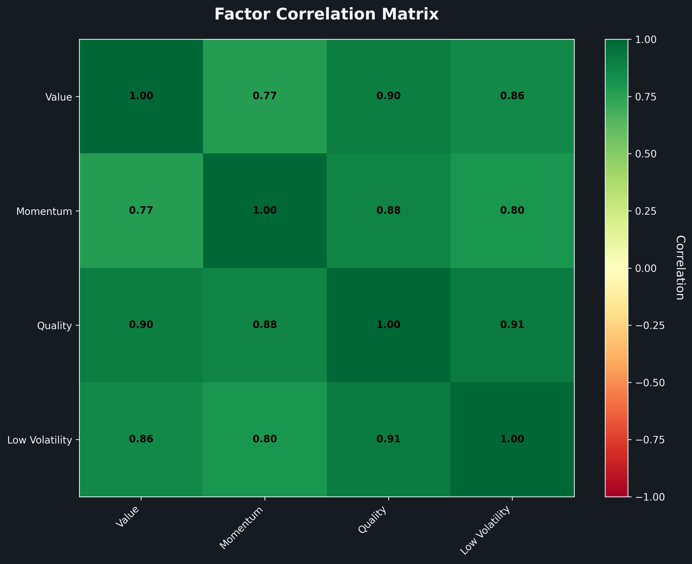
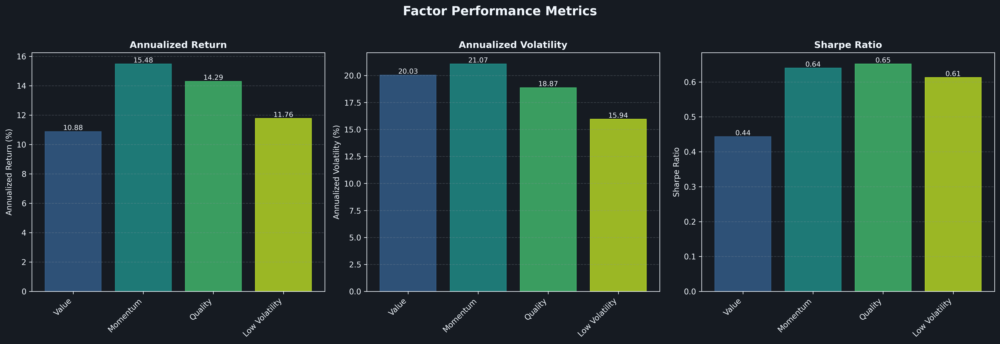
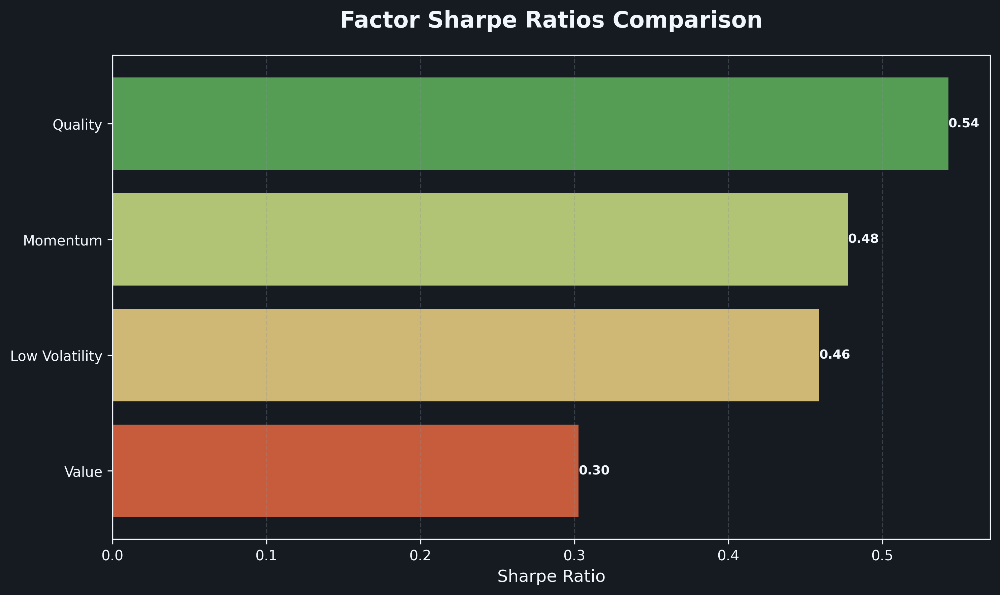
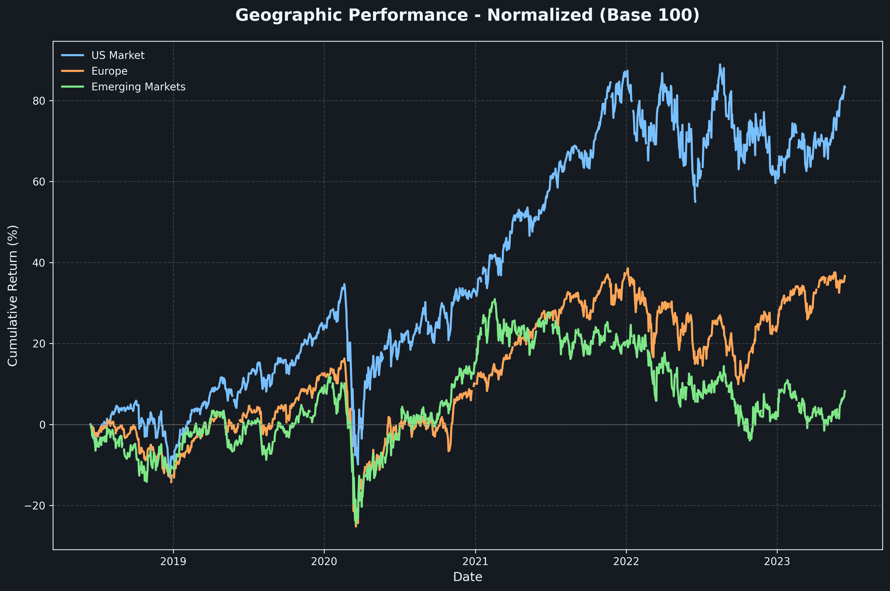
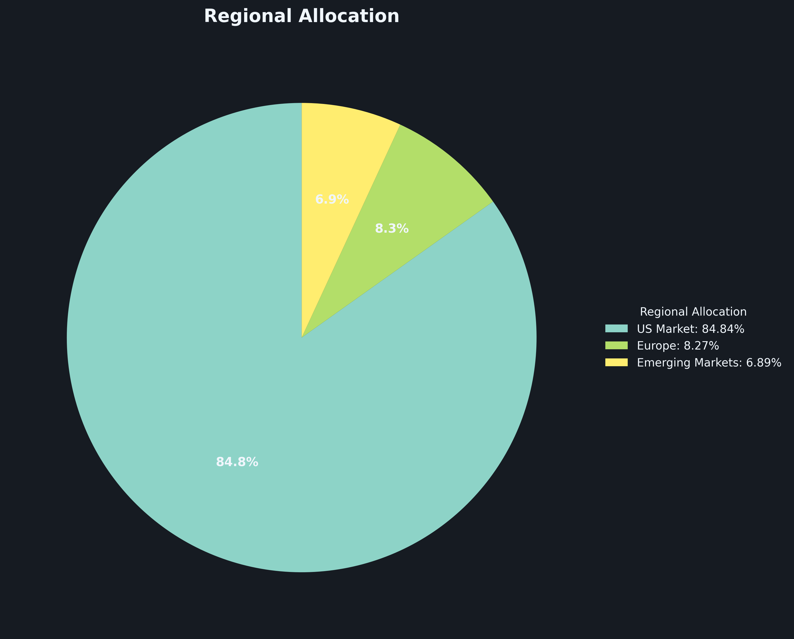
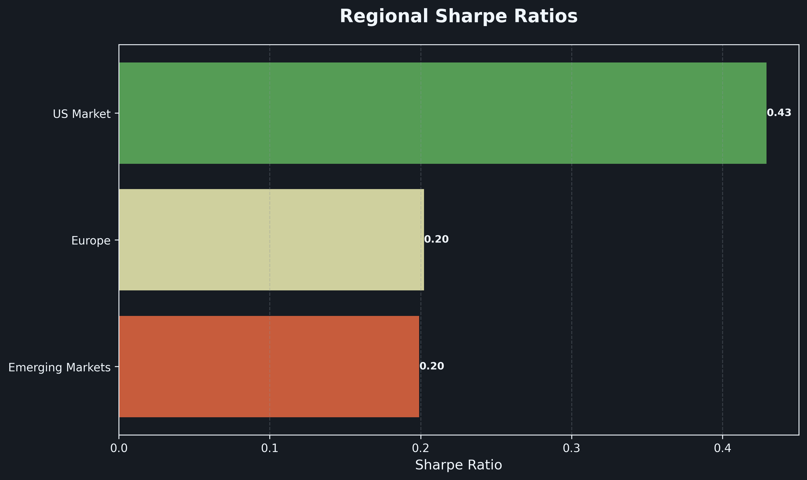

# Factor Investing Analyzer

[](https://creativecommons.org/licenses/by-nc/4.0/)
[](https://www.python.org/downloads/)

A production-grade Python application for analyzing factor-based and geographic investment strategies. This tool provides comprehensive performance analysis, risk metrics, and professional visualizations using real market data, **optimized for Euro-based investors**.

## Showcase

### Factor Analysis Visualizations

<div align="center">

#### Cumulative Returns Comparison

*Normalized performance comparison of factor-based ETFs over time*

#### Drawdown Analysis

*Peak-to-trough decline analysis showing risk exposure during downturns*

#### Factor Correlation Matrix

*Correlation heatmap revealing diversification opportunities between factors*

#### Performance Summary

*Comprehensive metrics table comparing returns, volatility, and risk-adjusted performance*

#### Sharpe Ratio Comparison

*Risk-adjusted return rankings across factor strategies*

</div>

### Geographic Analysis Visualizations

<div align="center">

#### Regional Performance

*Comparative performance of US, European, and Emerging Markets*

#### Regional Allocation

*Portfolio composition after market drift showing regional weights*

#### Regional Correlation Matrix

*Geographic diversification analysis through correlation patterns*

#### Regional Sharpe Ratios

*Risk-adjusted performance comparison across geographic regions*

</div>

## Features

- **Factor Analysis**: Evaluate classic investment factors including Value (VLUE), Momentum (MTUM), Quality (QUAL), and Low Volatility (USMV)
- **Geographic Analysis**: Compare performance across US (SPY), European (EXSA.DE), and Emerging Markets (EEM)
- **EUR Base Currency**: All returns and metrics displayed in EUR for accurate Euro investor perspective
- **Live Currency Conversion**: Automatic USD to EUR conversion using real historical EURUSD exchange rates
- **Performance Metrics**: Cumulative returns, drawdowns, Sharpe ratios, Sortino ratios, and correlation analysis
- **Professional Visualizations**: Dark-themed charts using matplotlib with matplotx styling
- **Robust Data Handling**: Fallback to realistic mock data if market data unavailable

## Project Structure

```
factor-investing-analyzer/
├── data/                  # Data storage directory
├── output/                # Generated charts and reports
├── src/
│   ├── __init__.py       # Package initialization
│   ├── main.py           # Main orchestrator
│   ├── factors.py        # Data loading with currency conversion
│   ├── analysis.py       # Performance metrics calculation
│   ├── geography.py      # Geographic analysis
│   └── visualizer.py     # Chart generation
├── config.py             # Configuration settings
├── requirements.txt      # Python dependencies
└── README.md            # This file
```

## Installation

### Prerequisites

- Python 3.10 or higher
- pip package manager

### Setup

1. Clone or download this repository

2. Install dependencies:
```bash
pip install -r requirements.txt
```

## Usage

### Basic Usage

Run the complete analysis with default date range (2000-01-01 to today):

```bash
python src/main.py
```

### Command-Line Arguments

Customize the analysis period using command-line arguments (Portuguese date format: DD/MM/YYYY):

```bash
# Analyze from a specific start date to today
python src/main.py --start-date 01/01/2015

# Analyze a specific date range
python src/main.py --start-date 01/01/2010 --end-date 31/12/2020

# Using short flags
python src/main.py -s 15/06/2018 -e 15/06/2023

# Show help and all available options
python src/main.py --help
```

### What the Analyzer Does

The analyzer will:
1. Accept dates in Portuguese format (DD/MM/YYYY)
2. Download historical price data from Yahoo Finance for the specified period
3. Fetch live EURUSD exchange rates for the analysis period
4. Convert USD-denominated ETFs to EUR (base currency)
5. Calculate comprehensive performance metrics in EUR
6. Generate professional visualizations
7. Save all outputs to the `output/` directory

## Configuration

### Command-Line Options

- **Date Range**: Use `--start-date` and `--end-date` arguments (see Usage section)
- **Help**: Run `python src/main.py --help` for all available options

### Configuration File

Edit `config.py` to customize:

- **Tickers**: Modify `FACTOR_TICKERS` and `GEOGRAPHY_TICKERS` dictionaries
- **Default Date Range**: Adjust `START_DATE` and `END_DATE` defaults
- **Analysis Parameters**: Change `RISK_FREE_RATE` or `TRADING_DAYS_PER_YEAR`
- **Visualization Settings**: Customize `FIGURE_SIZE`, `DPI`, and theme

## Output Files

The analyzer generates the following visualizations in the `output/` directory:

### Factor Analysis
- `factor_cumulative_returns.png` - Cumulative performance over time
- `factor_drawdowns.png` - Drawdown analysis
- `factor_correlation_matrix.png` - Factor correlation heatmap
- `factor_performance_summary.png` - Key metrics comparison
- `factor_sharpe_comparison.png` - Sharpe ratio ranking

### Geographic Analysis
- `geography_performance.png` - Regional performance comparison
- `geography_allocation_pie.png` - Ending portfolio composition after market drift
- `geography_correlation_matrix.png` - Regional correlation heatmap
- `geography_sharpe_comparison.png` - Regional Sharpe ratio ranking

## Key Metrics Calculated

- **Total Return**: Overall percentage gain/loss
- **Annualized Return**: Compound annual growth rate (CAGR)
- **Annualized Volatility**: Standard deviation of returns
- **Sharpe Ratio**: Risk-adjusted return metric
- **Sortino Ratio**: Downside risk-adjusted return
- **Maximum Drawdown**: Largest peak-to-trough decline
- **Correlation Matrix**: Pairwise correlations between assets

## Technical Details

### Currency Conversion (EUR Base Currency)

**All analysis is performed in EUR** to reflect the true returns for Euro-based investors. USD-denominated ETFs (SPY, EEM, VLUE, MTUM, QUAL, USMV) are automatically converted to EUR using historical EURUSD=X exchange rates from Yahoo Finance. The system:

1. Downloads daily EUR/USD exchange rates for the entire analysis period
2. Inverts the rates to calculate USD/EUR conversion factors
3. Applies the conversion to each USD-denominated asset's daily prices
4. Uses forward-fill to handle any missing rate data

If exchange rate data is unavailable, a fallback rate of 0.91 (approximately 1 USD = 0.91 EUR) is applied. This ensures **accurate historical performance** in your home currency, not arbitrary fixed-rate conversions.

### Data Resilience

If yfinance fails to retrieve data (network issues, API changes, etc.), the system automatically generates realistic mock data using geometric Brownian motion. This ensures the analysis pipeline always completes successfully.

## Dependencies

- **yfinance**: Market data retrieval
- **pandas**: Data manipulation and analysis
- **numpy**: Numerical computations
- **matplotlib**: Chart generation
- **matplotx**: Professional chart themes

## License

**Creative Commons Attribution-NonCommercial 4.0 International (CC BY-NC 4.0)**

You are free to:
- **Share**: Copy and redistribute the material in any medium or format
- **Adapt**: Remix, transform, and build upon the material

Under the following terms:
- **Attribution**: You must give appropriate credit to Lucas Caetano
- **NonCommercial**: You may not use the material for commercial purposes

For commercial use, please contact the author.

Full license: https://creativecommons.org/licenses/by-nc/4.0/

## Author

**Lucas Caetano**  
GitHub: [@LucasRibeiroCaetano](https://github.com/LucasRibeiroCaetano)

---

**Disclaimer**: This analyzer uses real market data for educational and analytical purposes. Past performance does not guarantee future results. This tool is for analysis and educational purposes only, not investment advice. The author assumes no responsibility for investment decisions made based on this analysis.
